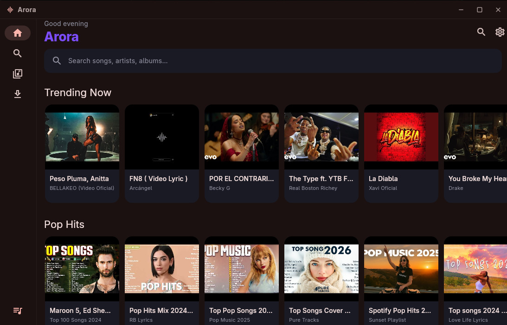
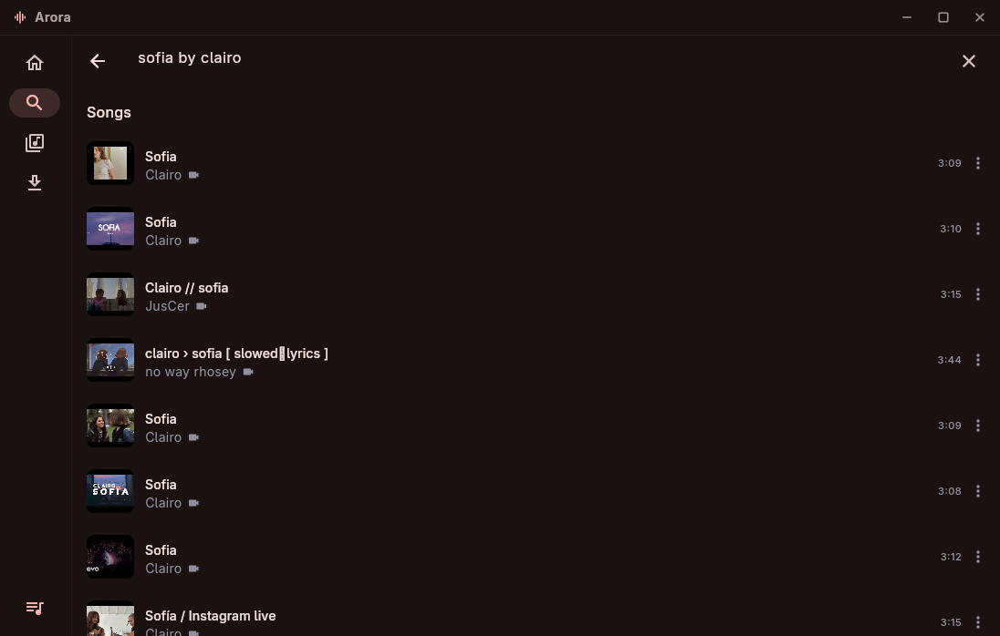
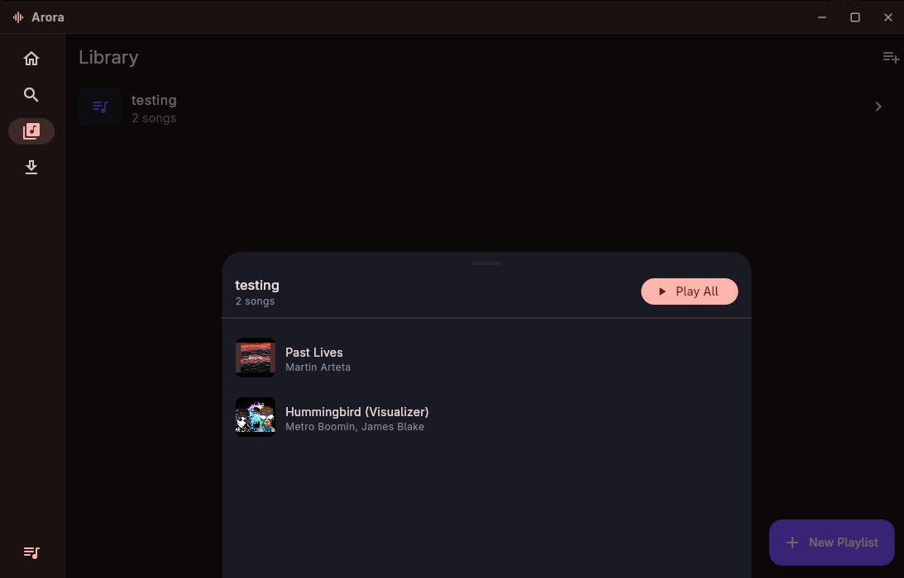
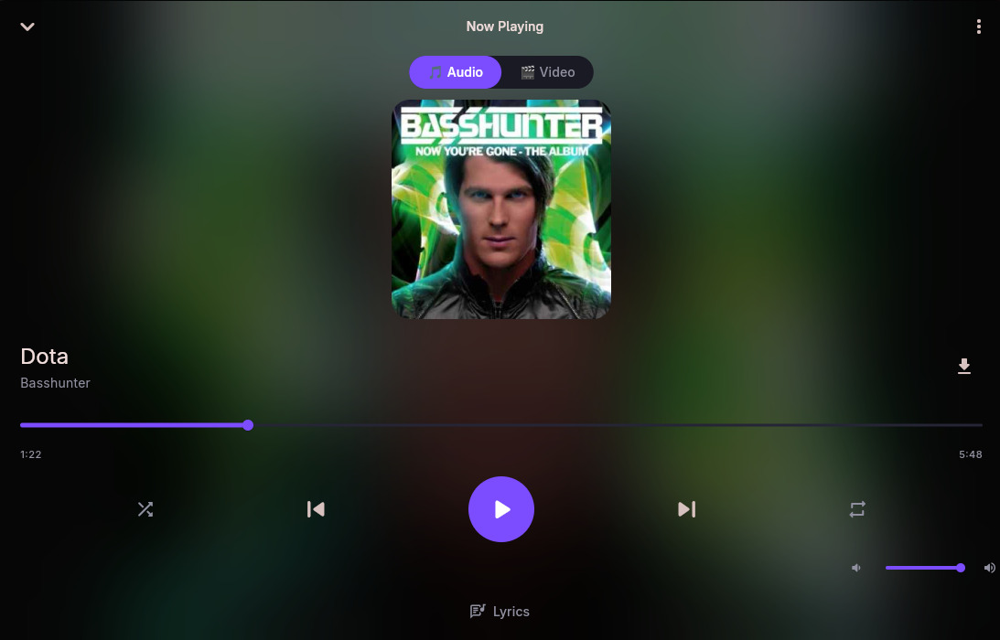
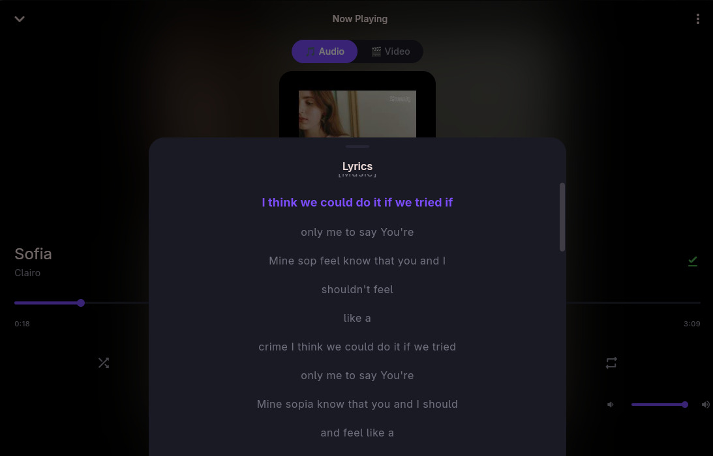
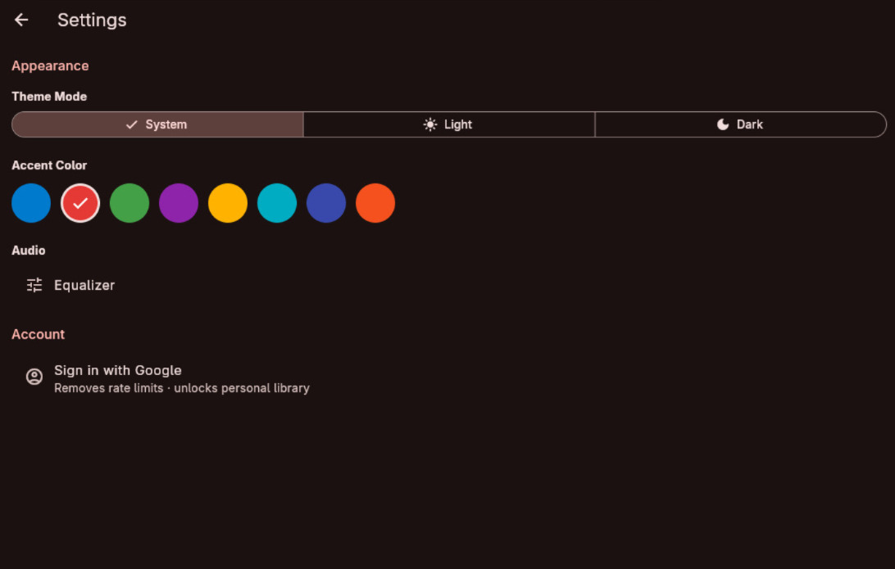

<div align="center">
  
  <h1>Arora</h1>
  <p><strong>Stream music and videos from YouTube. Free, open-source, no ads.</strong></p>

  <p>
    
    
    
  </p>

  <p>
    <a href="https://github.com/degeneratedstupidity/arora/releases/latest">
      
    </a>
    &nbsp;
    <a href="https://github.com/degeneratedstupidity/arora/releases/latest">
      
    </a>
    &nbsp;
    <a href="https://github.com/degeneratedstupidity/arora/releases/latest">
      
    </a>
  </p>
</div>

---

## Screenshots

<table>
  <tr>
    <td align="center"><br/><sub>Home — Trending &amp; Genre Discovery</sub></td>
    <td align="center"><br/><sub>Search</sub></td>
    <td align="center"><br/><sub>Library &amp; Playlists</sub></td>
  </tr>
  <tr>
    <td align="center"><br/><sub>Now Playing</sub></td>
    <td align="center"><br/><sub>Synced Lyrics</sub></td>
    <td align="center"><br/><sub>Settings &amp; Theming</sub></td>
  </tr>
</table>

---

## Features

| | |
|---|---|
| 🎵 **Ad-free streaming** | Audio streamed directly from YouTube — no Premium required |
| 🎬 **Music video mode** | Switch to HD video for any track on the Now Playing screen |
| 🔀 **Smart Shuffle** | Queue auto-refills with related tracks; uses recently played songs as alternate seeds for variety |
| 💡 **Personalized recommendations** | "Because you listened to X" section powered by your play history |
| 🎙️ **Synced lyrics** | Lyrics from YouTube closed captions, scrolling in real time |
| 📥 **Offline playback** | Download any track to play without an internet connection |
| 📚 **Playlist management** | Create, edit, reorder, and delete playlists stored locally |
| 🔗 **YouTube playlist import** | Paste a YouTube playlist URL to import it in one tap |
| 🔍 **Search history** | Recent searches saved locally; tap to re-search or swipe to clear |
| 🎨 **Theme customization** | Material 3 with accent color picker and light / dark / system modes |
| 🖥️ **Adaptive layout** | Bottom nav on mobile, collapsible sidebar on desktop |
| ⌨️ **Hardware media keys** | Play/Pause, Next, Previous and Ctrl/Cmd+Arrow shortcuts |
| 🔔 **Background audio** | Persistent notification with play/pause/skip; lock screen controls; Bluetooth headset support |
| 🎚️ **Equalizer** | Per-band EQ and Loudness Enhancer (Android only) |
| 🔐 **Google Sign-In** | Link your Google account to unlock your personal YouTube library |

---

## Download

Head to the [**Releases page**](https://github.com/degeneratedstupidity/arora/releases/latest) and grab the file for your platform.

### Android

1. Download `arora-vX.X.X-android.apk`
2. On your phone: **Settings → Apps → Special app access → Install unknown apps** → allow your file manager
3. Open the APK and tap **Install**

### Linux (x86_64)

```bash
# One-time: install the audio backend
sudo pacman -S mpv           # Arch / Manjaro
sudo apt install libmpv-dev  # Ubuntu / Debian

# Make executable and run
chmod +x arora-*-linux-x86_64.AppImage
./arora-*-linux-x86_64.AppImage
```

The AppImage is fully self-contained — move it anywhere you like.

### Windows

Download and extract `arora-vX.X.X-windows.zip`, then run `arora.exe`.

---

## Platform Support

| Platform | Status |
|---|---|
| Linux (x86_64) | ✅ Confirmed working |
| Android | ✅ Confirmed working |
| Windows | ✅ Confirmed working |
| macOS | 🔧 Should work — untested |
| iOS | 🔧 Should work — untested |
| Web | ⚠️ Partial support |

---

## Known Limitations

| Limitation | Detail |
|---|---|
| Playback start latency | ~2-4 s for the first play of any uncached song (YouTube API round-trips) |
| Skip on single-song queue | ~4-8 s — recommendations must be fetched before the next URL |
| Audio quality | 96 kbps AAC (YouTube CDN blocks audio-only streams for external players) |
| Equalizer | Android only |
| Offline shuffle | Requires network to refill the queue |

---

## Tech Stack

| Layer | Library |
|---|---|
| UI framework | Flutter 3.x |
| State management | Riverpod 3.x (annotation-based) |
| Navigation | go_router 14.x |
| Audio | just_audio + just_audio_media_kit (Linux) |
| Background audio | audio_service |
| Video | video_player + chewie |
| YouTube data | youtube_explode_dart 3.x |
| Authentication | google_sign_in 6.x |
| Local storage | Hive CE |
| Code generation | Freezed 3, Riverpod Generator, Hive CE Generator |

---

## Building from Source

### Prerequisites

- [Flutter SDK](https://docs.flutter.dev/get-started/install) ≥ 3.3
- **Linux:** `sudo pacman -S mpv` or `sudo apt install libmpv-dev`
- **Android:** Android Studio with JDK 21

### Steps

```bash
# Clone
git clone https://github.com/degeneratedstupidity/arora.git
cd arora

# Install dependencies
flutter pub get

# Generate code (Freezed, Riverpod, Hive adapters)
dart run build_runner build --delete-conflicting-outputs

# Run
flutter run -d linux    # Linux desktop
flutter run             # Android / iOS
```

> No API key needed — `youtube_explode_dart` reverse-engineers YouTube's internal API, the same technique used by yt-dlp.

---

## Architecture

Arora follows **Clean Architecture** with a feature-first directory layout. All UI and business logic depends on the abstract `MusicProvider` interface — swapping the entire music backend requires implementing one interface and changing one line in `app.dart`.

```
lib/
├── core/           # Theme, constants, logging
├── domain/         # Entities, use-cases, MusicProvider contract
├── data/           # Repositories, Hive database
├── infrastructure/ # YouTube implementation, Google OAuth
├── services/       # Audio engine, downloads, cache, smart shuffle
├── features/       # UI screens — home, search, player, library, queue
└── shared/         # Reusable widgets and providers
```

---

## Contributing

All contributions are welcome — bug fixes, new features, UI improvements, or a brand new music provider.

```bash
# Before opening a PR
dart run build_runner build --delete-conflicting-outputs
flutter analyze
flutter test
```

- **Bug reports** — open a GitHub Issue with steps to reproduce
- **Feature requests** — start a Discussion
- **New music provider** — implement `MusicProvider` and register it in `app.dart`

---

## License

MIT — see [LICENSE](LICENSE) for details.

---

## Acknowledgments

- [`youtube_explode_dart`](https://pub.dev/packages/youtube_explode_dart) — backbone of all YouTube integration
- [YoutubeExplode](https://github.com/Tyrrrz/YoutubeExplode) (C#) — the original reverse-engineering work
- [Spotube](https://github.com/KRTirtho/spotube) — inspiration for an open-source Flutter music player
- [just_audio](https://pub.dev/packages/just_audio) + [media_kit](https://pub.dev/packages/media_kit) — cross-platform audio made possible
